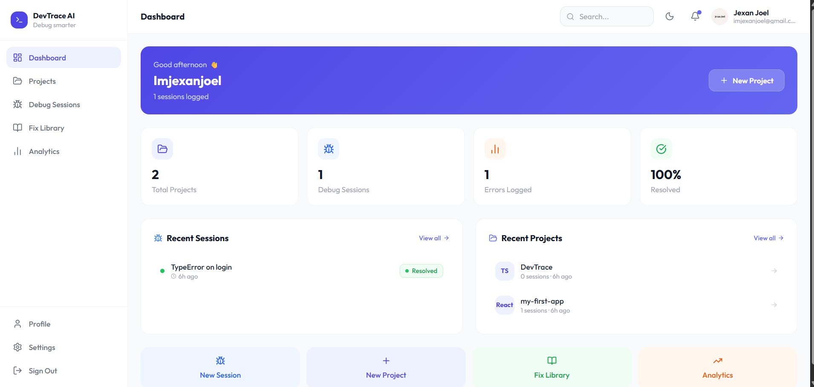

<div align="center">

# 🔍 DevTrace AI

[](https://dev-trace-ai.vercel.app) [](LICENSE) [](https://github.com/JexanJoel/DevTrace-AI/issues) [](https://github.com/JexanJoel/DevTrace-AI/issues)

<br/>

| | |
|:--|:--|
| 🐛 | **Log errors** with full stack traces and severity levels |
| ⚡ | **Get AI fixes** instantly via Groq + Llama 3.3 70B |
| 📚 | **Save what works** to a fix library you'll actually reuse |
| 📶 | **Works offline** - browse, create, and debug without internet |

</div>

---

## 📸 Preview

> **[→ Try the live demo](https://dev-trace-ai.vercel.app)**



---

## ✨ Features

| Feature | Description |
|:---|:---|
| 🐛 Session Tracking | Log errors with full stack traces, severity levels and status |
| ⚡ AI Fix Suggestions | Groq + Llama 3.3 70B analyzes errors and returns fixes instantly |
| 📚 Fix Library | Save AI-generated fixes and reuse them across all your projects |
| 📁 Workspace | Organize debug sessions by project and link GitHub repos |
| 📊 Error Analytics | Visualize resolution rates, error trends and severity breakdowns |
| 🐙 Repo Link | View stars, forks, open issues and last push date per project |
| 📶 Offline First | Offline-first with PowerSync - work offline, sync on reconnect |
| 🔄 Real-Time Sync | PowerSync streams Supabase changes to a local SQLite database instantly |
| 📱 Mobile Responsive | Collapsible slide in sidebar that works on all screen sizes |
| 🔐 Auth | GitHub OAuth, Google OAuth and Email + Password via Supabase |
| 🎨 Dark Mode | Full dark theme toggled from settings and saved to your profile |

---

## 🏗️ Tech Stack

<div align="center">

<table>
  <tr>
    <td align="center" width="130">
      <br/>
      <sub>Frontend</sub>
    </td>
    <td align="center" width="130">
      <br/>
      <sub>Language</sub>
    </td>
    <td align="center" width="130">
      <br/>
      <sub>Build Tool</sub>
    </td>
    <td align="center" width="130">
      <br/>
      <sub>Styling</sub>
    </td>
  </tr>
  <tr>
    <td align="center" width="130">
      <br/>
      <sub>Database & Auth</sub>
    </td>
    <td align="center" width="130">
      <br/>
      <sub>Offline Sync</sub>
    </td>
    <td align="center" width="130">
      <br/>
      <sub>AI Engine</sub>
    </td>
    <td align="center" width="130">
      <br/>
      <sub>Deployment</sub>
    </td>
  </tr>
  <tr>
    <td align="center" width="130">
      <br/>
      <sub>State</sub>
    </td>
    <td align="center" width="130">
      <br/>
      <sub>Charts</sub>
    </td>
    <td align="center" width="130">
      <br/>
      <sub>Icons</sub>
    </td>
    <td align="center" width="130">
      <br/>
      <sub>AI Model</sub>
    </td>
  </tr>
</table>

</div>

---

## 📶 Offline First Architecture (PowerSync)

DevTrace AI is fully **local-first** powered by [PowerSync](https://www.powersync.com/). Your data is always available - even without internet.

```
Online:   Supabase ──► PowerSync ──► Local SQLite ──► UI (instant reads)
Offline:  Create/browse locally ──► queued in localStorage ──► auto-syncs on reconnect
```

| Scenario | Behavior |
|:---|:---|
| ✅ Online | Data syncs in real time from Supabase via PowerSync streams |
| 🟠 Offline | Orange banner shown - all existing data available from local SQLite |
| ✏️ Create offline | Projects/sessions saved locally and queued - synced to Supabase on reconnect |
| 🔄 Reconnect | Pending items automatically uploaded, duplicates safely handled |

---

## 🏆 Hackathon - PowerSync AI Hackathon 2026

DevTrace AI is submitted to the **[PowerSync AI Hackathon 2026](https://www.powersync.com/)** targeting:

- **🥇 Core Prize** - AI-powered developer tool built during the hackathon window
- **🏅 Best Submission Using Supabase** - Supabase powers auth, database (RLS), and storage throughout
- **🏅 Best Local-First App** - Full offline-first experience powered by PowerSync with real-time sync, local SQLite reads, and offline write queuing

---

## 🚀 Getting Started

### Prerequisites

- Node.js 18+
- [Supabase](https://supabase.com) account (free)
- [Groq](https://groq.com) API key (free)
- [PowerSync](https://www.powersync.com) account (free)

### 1. Clone

```bash
git clone https://github.com/JexanJoel/DevTrace-AI.git
cd DevTrace-AI/DevTrace
```

### 2. Supabase Setup

1. Create a project at [supabase.com](https://supabase.com)
2. Run the SQL schema:

<details>
<summary>📋 Click to expand SQL setup</summary>

```sql
-- Profiles
create table profiles (
  id uuid references auth.users on delete cascade primary key,
  name text, email text, github_username text,
  avatar_url text, onboarded boolean default false,
  dark_mode boolean default false,
  created_at timestamp with time zone default timezone('utc', now())
);

create or replace function public.handle_new_user() returns trigger as $$
begin insert into public.profiles (id, email) values (new.id, new.email); return new; end;
$$ language plpgsql security definer;

create trigger on_auth_user_created
  after insert on auth.users for each row execute procedure public.handle_new_user();

alter table profiles enable row level security;
create policy "Users can view own profile" on profiles for select using (auth.uid() = id);
create policy "Users can update own profile" on profiles for update using (auth.uid() = id);

-- Projects
create table projects (
  id uuid default gen_random_uuid() primary key,
  user_id uuid references auth.users on delete cascade,
  name text not null, description text, language text, github_url text,
  error_count int default 0, session_count int default 0,
  created_at timestamp with time zone default timezone('utc', now()),
  updated_at timestamp with time zone default timezone('utc', now())
);
alter table projects enable row level security;
create policy "Users can view own projects" on projects for select using (auth.uid() = user_id);
create policy "Users can create projects" on projects for insert with check (auth.uid() = user_id);
create policy "Users can update own projects" on projects for update using (auth.uid() = user_id);
create policy "Users can delete own projects" on projects for delete using (auth.uid() = user_id);

-- Debug Sessions
create table debug_sessions (
  id uuid default gen_random_uuid() primary key,
  user_id uuid references auth.users on delete cascade,
  project_id uuid references projects on delete cascade,
  title text not null, error_message text, stack_trace text,
  severity text default 'medium', status text default 'open',
  ai_fix text, notes text,
  created_at timestamp with time zone default timezone('utc', now()),
  updated_at timestamp with time zone default timezone('utc', now())
);
alter table debug_sessions enable row level security;
create policy "Users can view own sessions" on debug_sessions for select using (auth.uid() = user_id);
create policy "Users can create sessions" on debug_sessions for insert with check (auth.uid() = user_id);
create policy "Users can update own sessions" on debug_sessions for update using (auth.uid() = user_id);
create policy "Users can delete own sessions" on debug_sessions for delete using (auth.uid() = user_id);

-- Fixes
create table fixes (
  id uuid default gen_random_uuid() primary key,
  user_id uuid references auth.users on delete cascade,
  session_id uuid references debug_sessions on delete set null,
  project_id uuid references projects on delete set null,
  title text not null, error_pattern text, fix_content text not null,
  language text, tags text[], use_count int default 0,
  created_at timestamp with time zone default timezone('utc', now())
);
alter table fixes enable row level security;
create policy "Users can view own fixes" on fixes for select using (auth.uid() = user_id);
create policy "Users can create fixes" on fixes for insert with check (auth.uid() = user_id);
create policy "Users can update own fixes" on fixes for update using (auth.uid() = user_id);
create policy "Users can delete own fixes" on fixes for delete using (auth.uid() = user_id);

-- Triggers
create or replace function update_updated_at() returns trigger as $$
begin new.updated_at = timezone('utc', now()); return new; end;
$$ language plpgsql;
create trigger projects_updated_at before update on projects for each row execute procedure update_updated_at();
create trigger sessions_updated_at before update on debug_sessions for each row execute procedure update_updated_at();

-- PowerSync replication
create publication powersync for table profiles, projects, debug_sessions, fixes;
```

</details>

3. In **Auth → Settings**: disable **Confirm email**, set Site URL to `http://localhost:5173`
4. Enable **GitHub + Google** OAuth providers
5. Create a storage bucket called `avatars` set to **public**

### 3. PowerSync Setup

1. Create a free account at [powersync.com](https://www.powersync.com)
2. Create a new project and connect it to your Supabase instance via the direct Postgres URI
3. Add the sync rules:

```json
{
  "bucket_definitions": {
    "user_data": {
      "parameters": "SELECT request.user_id() as user_id",
      "data": [
        "SELECT * FROM profiles WHERE id = bucket.user_id",
        "SELECT * FROM projects WHERE user_id = bucket.user_id",
        "SELECT * FROM debug_sessions WHERE user_id = bucket.user_id",
        "SELECT * FROM fixes WHERE user_id = bucket.user_id"
      ]
    }
  }
}
```

4. Copy your **PowerSync instance URL**

### 4. Frontend

```bash
cd client && npm install
```

Create `client/.env`:

```env
VITE_SUPABASE_URL=your_supabase_project_url
VITE_SUPABASE_ANON_KEY=your_supabase_anon_key
VITE_GROQ_API_KEY=your_groq_api_key
VITE_POWERSYNC_URL=your_powersync_instance_url
```

### 5. Backend

```bash
cd ../server && npm install
```

Create `server/.env`:

```env
PORT=4000
SUPABASE_URL=your_supabase_project_url
SUPABASE_SERVICE_ROLE_KEY=your_supabase_service_role_key
```

### 6. Run

```bash
# Terminal 1 — Frontend
cd client && npm run dev     # http://localhost:5173

# Terminal 2 — Backend
cd server && npm run dev     # http://localhost:4000
```

---

## 📁 Project Structure

```
DevTrace-AI/
└── DevTrace/
    ├── client/                  # React + Vite frontend
    │   └── src/
    │       ├── components/      # auth, dashboard, sessions, fixes, projects
    │       ├── hooks/           # Custom React hooks (PowerSync + data)
    │       ├── lib/             # Supabase, Groq, PowerSync clients
    │       ├── pages/           # Route-level page components
    │       ├── store/           # Zustand stores (auth, theme)
    │       └── types/           # TypeScript types
    └── server/                  # Express backend
        └── src/
            ├── routes/          # Auth routes
            ├── middleware/       # JWT verification
            └── lib/             # Supabase admin client
```

---

## 🤝 Contributing

Contributions, issues, and feature requests are welcome!

1. Fork the repo
2. Create your branch: `git checkout -b feature/amazing-feature`
3. Commit: `git commit -m 'Add amazing feature'`
4. Push: `git push origin feature/amazing-feature`
5. Open a Pull Request

---

## 🙋 FAQ

<details>
<summary><b>Is DevTrace AI free to use?</b></summary>
<br/>
Yes - fully open source under MIT. Groq, Supabase, and PowerSync all have generous free tiers, so you can self-host at zero cost.
</details>

<details>
<summary><b>Is my error data private?</b></summary>
<br/>
Yes. All data is stored in your own Supabase project with Row Level Security (RLS) enabled. Only you can access your sessions, projects, and fixes.
</details>

<details>
<summary><b>Does it really work offline?</b></summary>
<br/>
Yes. PowerSync syncs your data to a local SQLite database in the browser. You can browse all your projects, sessions, and fixes without internet. New items created offline are saved locally and automatically synced to Supabase when connectivity is restored.
</details>

<details>
<summary><b>Which AI model is used?</b></summary>
<br/>
Llama 3.3 70B served via Groq's ultra-fast inference API. You can swap the model in <code>client/src/lib/groqClient.ts</code>.
</details>

<details>
<summary><b>Can I use this without the Express backend?</b></summary>
<br/>
The Express server handles OAuth token exchange. If you only use email/password auth you can skip it, but GitHub and Google OAuth require the backend.
</details>

---

## 📄 License

Distributed under the **MIT License** - see [`LICENSE`](LICENSE) for details.

Free to use, fork, modify, and build upon. A ⭐ star is always appreciated!

---

<div align="center">

Built with ❤️ by JexanJoel for the **PowerSync AI Hackathon 2026**

</div>